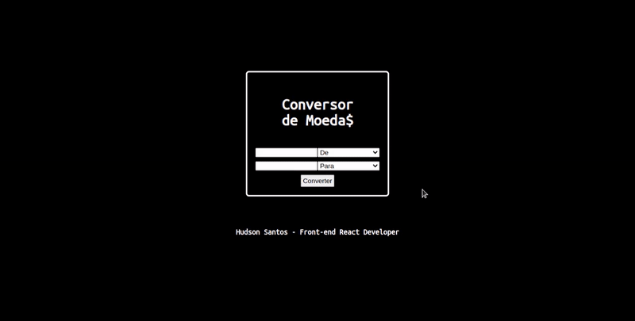

# Conversor de Moeda$

## Sobre

  

O Conversor de Moeda$ é uma aplicação web responsiva que permite a conversão de várias moedas de acordo com a cotação atual atualizada.

Acesse o projeto: https://hudsonsamuelsantos.github.io/conversor-de-moedas-react/

## Funcionalidades:

:heavy_check_mark:  Converter o valor de várias moedas de acordo com a cotação atual atualizada.

:heavy_check_mark:  Adaptação em vários tamanhos de tela

## Tecnologias utilizadas:

- React, Hooks
- Javascript
- Fetch API
- Free Currency Converter API

## Desenvolvedor :octocat:

**Linkedin:** [Hudson Santos](https://www.linkedin.com/in/hudsonsamuelsantos/)
